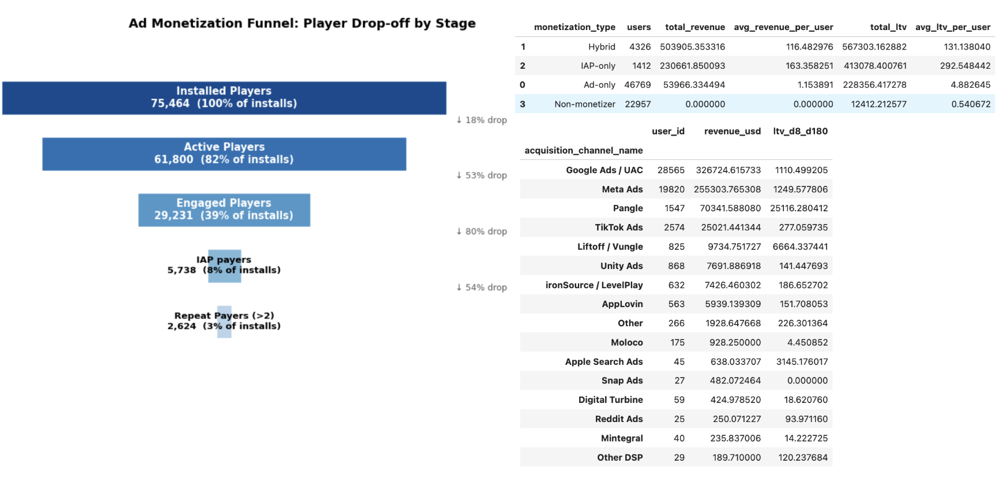
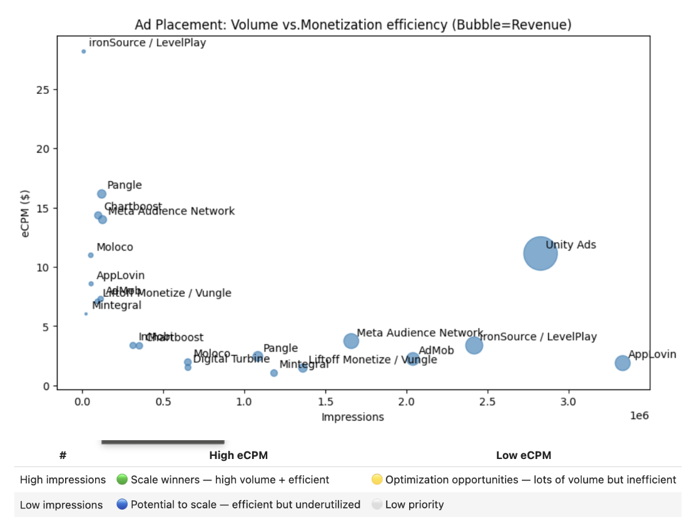
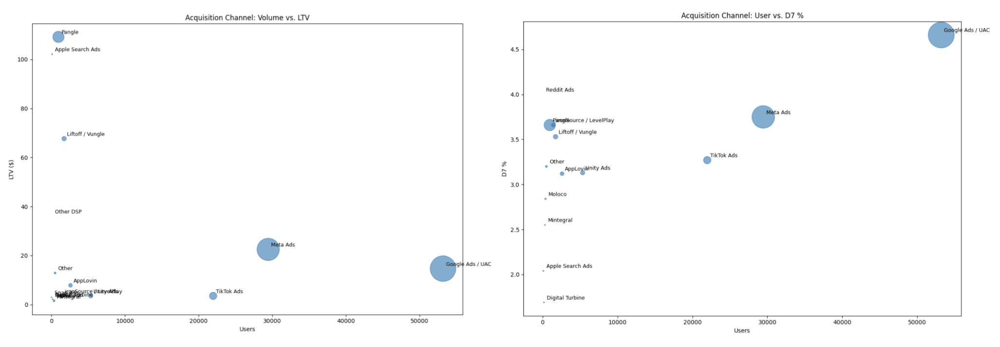

# Mobile Game Player & AdTech Analytics: Monetization, Engagement & LTV

**Product Analytics | Gaming | AdTech | Monetization | User Acquisition | Experimentation | LTV**

> **How can a mobile game acquire high-quality players, optimize advertising and IAP monetization, and maximize long-term player value without compromising engagement and retention?**

This project analyzes anonymized mobile game event data to understand the relationship between **user acquisition, player engagement, retention, advertising behavior, IAP conversion, monetization, and long-term LTV.**

Rather than treating acquisition, engagement, advertising, and IAP as isolated KPIs, the analysis builds an end-to-end view of the player and monetization lifecycle:

User Acquisition → Gameplay & Engagement → Retention → Ad Exposure → Ad Monetization → IAP Conversion → Long-Term LTV

The project combines **product analytics, AdTech, user acquisition, monetization analytics, and experimentation** to answer practical questions faced by gaming and consumer-product teams.

Key areas include:

- **IAP Monetization:** How do payer conversion and IAP revenue contribute to overall player economics alongside advertising revenue?
- **AdTech & Advertising Monetization:** Which ad networks and placements generate the strongest combination of impression volume, eCPM, ad revenue, and player value?
- **User Acquisition:** Which acquisition channels and player segments generate high-quality users relative to acquisition cost?
- **Product Engagement:** How do player engagement, session behavior, and retention relate to downstream monetization?
---

# Executive Summary
### 1. In-App Purchase Monetization Funnel & Diagnostic Analysis

| # | Hypothesis | Result | Business Implication |
|---|---|---|---|
| H1 | High installs ≠ high IAP monetization quality — converting engaged non-payers is a bigger lever than increasing spend among existing payers. | **Supported.** Of 61,800 active players, only 5,738 (~9.3%) become IAP payers — first-purchase conversion is a far larger funnel opportunity than increasing spend among existing payers. | Prioritize first-purchase conversion among engaged non-payers via personalized offers and lifecycle incentives, while growing purchase frequency among repeat payers without harming engagement or retention. |
| H2 | IAP monetization efficiency varies significantly across acquisition channels. | **Supported.** Pangle and Liftoff/Vungle generate substantially higher LTV per user than high-volume channels like Google and Meta — acquisition quality, not just volume, drives IAP value. | Allocate incremental acquisition spend based on expected IAP LTV and LTV/CAC rather than volume, while validating high-LTV small channels before scaling them materially. |
| H3 | Hybrid monetizers (ad + IAP) generate higher total revenue and LTV than single-channel monetizers. | **Partially supported.** Hybrid monetizers generate substantially higher total revenue and LTV than ad-only players, but IAP-only players have the highest revenue and LTV *per user*. Hybrid players still represent the largest-scale opportunity, pairing meaningful per-user value with a much larger base than IAP-only players. | Treat hybrid monetization as the key scaling opportunity: identify high-engagement ad-only players and test targeted IAP offers that add purchase revenue without reducing ad engagement or retention. |



---

### 2. Ad Monetization Funnel & Diagnostic Analysis

| # | Hypothesis | Result | Business Implication |
|---|---|---|---|
| H1 | Ad exposure (not impression yield) is the primary constraint on total ad revenue. | **Partially supported.** 82.7% of active players (51,095/61,800) are ad-exposed, leaving ~17% unexposed. But with 18.6M impressions at a $4.05 eCPM, improving monetization yield among already-exposed players may be as large an opportunity as expanding exposure. | Expand ad penetration among the unexposed ~17% of active players while shifting impression mix toward higher-eCPM network/placement combinations, using retention as a guardrail. |
| H2 | Ad monetization efficiency varies meaningfully by format/placement, network, platform, country, and lifecycle stage. | **Supported.** eCPM ranges from roughly $1 to $28 across network-placement combinations, and is highest immediately post-install before declining as players mature. | Shift impression volume toward higher-yield network/placement combinations and tune ad frequency by lifecycle stage, optimizing eCPM and retention jointly rather than maximizing impressions alone. |
| H3 | High impression volume does not necessarily mean high revenue efficiency. | **Strongly supported.** ironSource/LevelPlay generates $28.17 eCPM on just 10.9K impressions, while AppLovin generates only $1.88 eCPM across 3.33M impressions. | Prioritize scaling lower-volume, high-eCPM placements where added inventory won't dilute yield, while optimizing or reducing exposure on high-volume, low-eCPM placements. |



---

### 3. Acquisition Channel → Retention/LTV

| # | Hypothesis | Result | Business Implication |
|---|---|---|---|
| H1 | Acquisition channels differ in downstream player quality. | **Supported.** Pangle and Apple Search Ads produce the highest observed LTV (~$109 and ~$102), versus ~$23 and ~$15 for high-volume channels Meta and Google. | Shift incremental UA investment toward higher-LTV channels, validate small-sample winners through controlled testing, and set channel-specific LTV/CAC targets rather than optimizing for installs alone. |
| H2 | High install-volume channels do not necessarily generate the highest retention or LTV. | **Supported.** Google and Meta drive the most installs but produce substantially lower LTV than smaller channels like Liftoff/Vungle and Apple Search Ads. | Move UA allocation from install-volume optimization to LTV- and retention-based targets, using incremental value by channel as the primary scaling criterion. |
| H3 | Channel quality varies by platform and geography. | **Supported.** iOS shows higher D7 retention and LTV than Android across major channels (Meta, Google, Liftoff/Vungle); Pangle performs especially strongly as an iOS-only channel. | Optimize UA budgets by channel × platform rather than channel alone, prioritizing high-LTV platform segments while validating extreme results against sample size before scaling spend. |



---
# Detailed Results
## 1. In-App Purchase Monetization Funnel & Diagnostic Analysis
**Business question**

> **Where are the biggest opportunities to increase in-app purchase (IAP) revenue by improving player conversion, purchase frequency, and payer value across platforms, acquisition channels, countries, and player lifecycle stages?**

**Hypotheses**
> **H1:** (High installs ≠ high monetization quality) A meaningful share of active/engaged players generates no IAP revenue, suggesting that converting engaged players into first-time purchasers is a larger opportunity than simply increasing spend among existing payers.

> **H2:** IAP monetization efficiency varies significantly across acquisition channels.

> **H3:** (IAP and ad monetization ≠ substitutes) Hybrid monetizers generate higher total revenue and LTV than players monetized exclusively through ads or IAP.
> - players can be (1) IAP-only, (2) Ad-only, (3) Hybrid monetizers, and (4) Non-monetizers
> - (3) Hybrid monetizers can be the biggest monetizing opportunity

**Result**
- **H1** — The results support H1: high player volume does not translate into high IAP monetization quality. Of 61,800 active players, only 5,738 (~9.3%) become IAP payers, indicating that first-purchase conversion is a much larger funnel opportunity than simply increasing spend among existing payers.
  - **Business implication / recommendation:** Prioritize first-purchase conversion among engaged non-payers, while using personalized offers and lifecycle incentives to retain and increase purchase frequency among repeat payers without harming engagement or retention.
- **H2:** — IAP monetization efficiency varies substantially across acquisition channels. Pangle and Liftoff/Vungle show exceptionally high LTV per user compared with high-volume channels such as Google and Meta, suggesting that acquisition quality—not just volume—is an important driver of IAP value.
  -  **Business implication / recommendation:** Allocate incremental acquisition spend based on expected IAP LTV and LTV/CAC rather than volume alone, while validating high-LTV small channels before materially scaling them.
- **H3** - The results partially support H3: hybrid monetizers generate substantially higher total revenue and LTV than ad-only players, but IAP-only players have the highest revenue and LTV per user. Hybrid players therefore represent a large-scale monetization opportunity because they combine meaningful value per user with a much larger user base than IAP-only players.
  -  **Business implication / recommendation:** Treat hybrid monetization as the key scaling opportunity: identify high-engagement ad-only players and test targeted IAP offers that add purchase revenue without reducing healthy ad engagement or retention.
  
## 2. Ad Monetization Funnel & Diagnostic Analysis

**Business question**

> **Where do players drop out of the advertising monetization funnel, and where are the biggest opportunities to improve ad monetization efficiency across formats, placements, networks, platforms, and player cohorts?**

The analysis first maps the end-to-end advertising funnel:

**Installed Players → Active Players → Ad-Exposed Players → Format/Placement Exposure → Monetized Impressions → Ad Revenue**

This distinguishes **reach, engagement, ad exposure, and monetization** rather than treating impressions or revenue as standalone metrics.

**Hypotheses**

> **H1:** Significant player drop-off occurs at different stages of the advertising funnel, limiting the number of players who ultimately contribute to ad revenue.

> **H2:** Advertising monetization efficiency varies meaningfully by **ad format, placement, network, platform, country, and player lifecycle stage**.

> **H3:** High impression volume does not necessarily translate into high revenue efficiency; some lower-volume inventory may generate disproportionately higher **eCPM and revenue/user**.

**Result**

- **H1** — The results partially support H1, but ad exposure is not the only constraint. About 82.7% of active players (51,095 / 61,800) are exposed to ads, leaving ~17% of active players unexposed; with 18.6M impressions and a $4.05 eCPM, the larger optimization opportunity may be improving monetization yield and exposure among the remaining active users.
   - **Business implication / recommendation:** Expand ad penetration among the ~17% of active players without ad exposure while optimizing network/placement mix toward higher-eCPM inventory, with retention as a guardrail.
- **H2:** — The results support H2: advertising monetization efficiency varies substantially by network/placement and across the player lifecycle. eCPM ranges from roughly $1 to $28 across network-placement combinations, while lifecycle eCPM is highest immediately after install and generally declines as players mature.
  -  **Business implication / recommendation:**  Shift impression volume toward higher-yield network/placement combinations and optimize ad frequency by player lifecycle, using eCPM and retention as joint objectives rather than maximizing impressions alone.
- **H3** - The results strongly support H3: impression volume does not necessarily translate into revenue efficiency. Several lower-volume placements generate dramatically higher eCPM and revenue/user than high-volume inventory—for example, ironSource/LevelPlay generates $28.17 eCPM on just 10.9K impressions, while AppLovin generates $1.88 eCPM across 3.33M impressions.
  -  **Business implication / recommendation:** Prioritize scaling lower-volume, high-eCPM placements where additional inventory can be added without materially reducing yield, while optimizing or reducing exposure from high-volume, low-eCPM placements.

**Metrics**

### Primary

* Ad revenue/user
* Ad revenue/DAU
* eCPM

### Secondary

* Ad impressions
* Impressions/user
* Unique users exposed
* Revenue/impression
* Rewarded-ad share
* Ad revenue by day since install

### Dimensions

* Ad format
* Placement
* Network
* Platform
* Country
* Day since install
* Install week
* Event hour

### Guardrails

* D1 retention
* D7 retention
* Sessions/user
* IAP revenue/user
* Total revenue/user

**Analysis**

Built the advertising funnel at the player/event level:

1. **Installed Players** — unique users in the dataset
2. **Active Players** — users with ≥1 `session_start`
3. **Ad-Exposed Players** — users with ≥1 ad impression
4. **Format/Placement Exposure** — users exposed to specific ad formats or placements
5. **Monetized Impressions** — ad impressions generating revenue
6. **Ad Revenue** — total advertising revenue

The funnel is then decomposed across **network × placement × format × platform × country × player lifecycle** to identify where scale and monetization efficiency diverge.


**Key skills:** Ad monetization funnel analysis · KPI development · AdTech analytics · dimensional/root-cause analysis · monetization optimization

---

## 3. Acquisition Channel → Retention & LTV

**Business question**

> Which acquisition channels bring players who remain engaged and generate long-term value?

**Hypothesis**

> **H1:** Acquisition channels differ in downstream player quality.

> **H2:** Channels generating high install volume do not necessarily generate the highest retention or LTV.

> **H3:** Channel quality varies by platform and geography.

**Result**
- **H1** — Acquisition channels show substantial differences in downstream player quality and LTV, supporting H1. Pangle and Apple Search Ads have the highest observed LTV (~$109 and $102), while high-volume channels such as Meta and Google generate much lower LTV per user (~$23 and ~$15).
  -  **Business implication / recommendation:** Shift incremental UA investment toward channels with higher observed LTV and monetization efficiency, while validating small-sample winners through controlled testing and setting channel-specific LTV/CAC targets rather than optimizing for installs alone.
- **H2** — The results support H2: the largest acquisition channels do not necessarily produce the highest-quality or highest-LTV users. Google and Meta drive the most installs, but their LTV is substantially below smaller channels such as Liftoff/Vungle and Apple Search Ads.
 -  **Business implication / recommendation:** Move from install-volume optimization toward LTV- and retention-based UA allocation, using LTV/CAC and incremental value by channel as the primary scaling criteria.
- **H3** — Platform performance varies substantially within acquisition channels, supporting H3. iOS generally shows higher D7 retention and LTV than Android for major channels such as Meta, Google, and Liftoff/Vungle, while Pangle is an especially strong iOS-only performer.
 -  **Business implication / recommendation:** Optimize UA budgets by channel × platform rather than channel alone, prioritizing high-LTV platform segments while validating extreme results with sufficient sample sizes before scaling spend.

**Channel-Level Metrics**
* Users acquired
* D1 retention
* D7 retention
* Sessions/user
* Active days
* Ad revenue/user
* IAP revenue/user
* IAP conversion
* Total revenue/user
* D8–D180 LTV

**Important limitation:** The dataset does not contain acquisition spend, so this analysis evaluates **player quality**, not true CPI, CAC, ROAS, or ROI.

**Skills:** UA analytics · cohort analysis · channel evaluation · LTV · acquisition quality

---


# The Product Story

These analyses are designed to answer one overarching product question:

> **How can a mobile game maximize sustainable player value across acquisition, engagement, advertising, and IAP monetization?**

```text
                     ACQUISITION
                         │
                         ▼
                ┌─────────────────┐
                │ Channel Quality │
                │ Country         │
                │ Platform        │
                └────────┬────────┘
                         │
                         ▼
                    ENGAGEMENT
                         │
                ┌────────┴────────┐
                │                 │
                ▼                 ▼
             RETENTION       AD EXPOSURE
                                  │
                                  ▼
                           AD MONETIZATION
                                  │
                    ┌─────────────┴─────────────┐
                    │                           │
                    ▼                           ▼
                   IAP                       AD REVENUE
                    │                           │
                    └─────────────┬─────────────┘
                                  ▼
                             PLAYER LTV
                                  │
                                  ▼
                         PRODUCT DECISIONS
```

**Player segmentation cuts across the entire system**, allowing the same lifecycle to be evaluated for different behavioral and monetization personas.

---

# Key Business Questions

| Analysis                   | Business Question                                                | Primary Outcome        |
| -------------------------- | ---------------------------------------------------------------- | ---------------------- |
| **Ad Monetization Funnel** | Where is monetization efficiency highest/lowest?                 | eCPM & Ad Revenue/User |
| **Engagement → LTV**       | Which early behaviors are associated with future value?          | D8–D180 LTV            |
| **Player Segmentation**    | Which player types behave and monetize differently?              | Segment LTV            |
| **Acquisition → LTV**      | Which channels acquire higher-quality players?                   | Channel LTV            |
| **Rewarded vs. Other Ads** | Which ad experience best balances monetization and player value? | LTV + Retention        |

---

# Dataset

The dataset contains event-level records from approximately:

* **41,300 training users**
* **10,300 test users**

Each player can have multiple event records.

### Event Types

* `session`
* `iap`
* `ad_impression`

### Key User Attributes

* `platform`
* `country_tier`
* `channel_tier`
* `install_day`
* `install_week`

### Key Event Attributes

* `day_since_install`
* `event_hour`
* `event_type`
* `event_name`
* `product_id`
* `network`
* `ad_placement`
* `revenue_usd`

### Prediction Target

`ltv_d8_d180`

The target represents revenue generated between **days 8–180** after install.

---

# Key Product Metrics

| **Area** | **Metrics** |
|---|---|
| **Engagement** | Sessions/user, active days/user, sessions/active day, ad exposure/user |
| **Funnel** | Install → Active → Ad-exposed → Monetized ad impression → Payer |
| **Retention** | D1, D3, D7 retention, retained users by cohort |
| **Advertising / AdTech** | Ad impressions, impressions/user, ad exposure rate, eCPM, ad revenue/user, ad revenue/DAU, network share, placement share |
| **IAP Monetization** | Payer conversion, IAP revenue/user, IAP revenue/payer, AOV, purchase frequency |
| **Total Monetization** | Total revenue/user, total revenue/DAU, ad revenue share, IAP revenue share |
| **Long-Term Value** | D8–D180 LTV, LTV by acquisition channel, LTV by player segment |
| **Player Segmentation** | Engagement tier, retention tier, payer/non-payer, monetization tier, behavioral segments |
| **User Acquisition** | Installs, channel share, CPI, acquisition spend, effective CPI |
| **UA Economics** | CAC, payer CAC, ROAS, LTV/CPI, revenue/spend, channel-level profitability |
| **Experimentation** | Treatment lift, D1/D7 retention lift, conversion lift, confidence intervals, statistical significance |
| **Guardrails** | D1/D7 retention, sessions/user, IAP revenue/user, total revenue/user, ad exposure intensity |

---

# Key Product Trade-offs

A central principle throughout the project is:

> **Optimizing a single monetization KPI can produce the wrong product decision.**

For example:

### More ads

→ Higher ad revenue

but potentially:

→ Lower engagement
→ Lower retention
→ Lower IAP
→ Lower long-term LTV

Similarly:

### Higher acquisition volume

does not necessarily mean:

→ Higher-quality players
→ Higher retention
→ Higher LTV

The analysis therefore evaluates monetization decisions against **player-value guardrails**.

---

# Limitations & Causal Considerations

Several analyses use observational event data.

Therefore:

> **Correlation between player behavior and LTV should not be interpreted as causal impact.**

For example, if rewarded-ad users have higher LTV, this does not necessarily mean rewarded ads caused the higher LTV.

Highly engaged players may simply be:

* more likely to watch rewarded ads
* more likely to make IAP purchases
* more likely to remain active
* more likely to generate long-term revenue

To address this, the analysis uses observable controls and regression where appropriate, while explicitly distinguishing **association from causation**.

For stronger causal decisions, the next step would be controlled experimentation or quasi-experimental measurement.

---

# Business Recommendations Framework

The analyses ultimately support four types of decisions:

### 1. Monetization Optimization

Identify:

* high-value placements
* high-performing networks
* efficient ad formats
* lifecycle opportunities

### 2. Player Experience

Monitor:

* retention
* engagement
* ad exposure intensity
* potential ad fatigue

### 3. Player-Level Strategy

Use behavioral segments to inform:

* monetization strategies
* rewarded-ad experiences
* re-engagement
* personalization

### 4. User Acquisition

Prioritize acquisition sources based on:

**Player Quality → Retention → Monetization → LTV**

rather than install volume alone.

---

# Why This Project Matters

This project demonstrates the ability to connect **product behavior to commercial outcomes** rather than analyzing individual metrics in isolation.

It combines:

**Product Analytics**

* Funnel analysis
* Cohort analysis
* Retention
* Behavioral analytics
* KPI development

**Gaming & AdTech**

* Ad formats
* Rewarded advertising
* Ad placements
* Ad networks
* eCPM
* Ad monetization

**Monetization**

* IAP
* Advertising revenue
* LTV
* Monetization trade-offs

**Data Science**

* Feature engineering
* Regression
* Clustering
* Hypothesis testing
* Confidence intervals

**Business Decision-Making**

* Acquisition quality
* Monetization optimization
* Player segmentation
* Product trade-offs
* Root-cause analysis

---

# Tools & Technologies

**Python**

* Pandas
* NumPy
* Scikit-learn
* SciPy
* Statsmodels
* Matplotlib

**Analytics**

* Cohort analysis
* Funnel analysis
* Behavioral segmentation
* Regression
* Hypothesis testing
* Confidence intervals

**Domain**

* Mobile gaming
* AdTech
* User acquisition
* Player monetization
* LTV
* Retention

---

## Final Takeaway

The analysis consistently supports one principle: **volume and value are not the same thing, at every stage of the player lifecycle.**

- The largest acquisition channels (Google, Meta) drive the most installs but produce the lowest LTV (~$15–$23), while smaller channels like Pangle and Apple Search Ads generate 4–7x higher LTV (~$102–$109) per user.
- The highest-volume ad inventory is often the least efficient — AppLovin delivers $1.88 eCPM across 3.33M impressions, while ironSource/LevelPlay delivers $28.17 eCPM on just 10.9K impressions.
- Only ~9.3% of active players ever convert to an IAP payer, meaning the largest monetization opportunity isn't increasing spend among existing payers — it's converting the 90.7% who never purchase.
- Hybrid monetizers (ad + IAP) generate the largest total revenue opportunity even though IAP-only players are more valuable individually, because hybrid players combine meaningful per-user value with a far larger base.

Taken together, these results argue against optimizing installs, impressions, or ad revenue in isolation. In every case — acquisition, ad inventory, and monetization type — the highest-volume option was not the highest-value one, and the biggest opportunities showed up in gaps (unconverted payers, unexposed players, underscaled high-eCPM inventory) rather than in scaling what already works.

The analysis connects:

**Acquisition → Engagement → Retention → Ad Exposure → Ad Monetization → IAP Conversion → Long-Term LTV**

with player segmentation and channel/inventory-level breakdowns identifying *where* in that chain value concentrates and *where* it's being left on the table.

This provides a practical framework for UA allocation, ad placement/network mix, rewarded-ad frequency, IAP conversion strategy, and long-term monetization — prioritized by LTV and efficiency, not volume.
